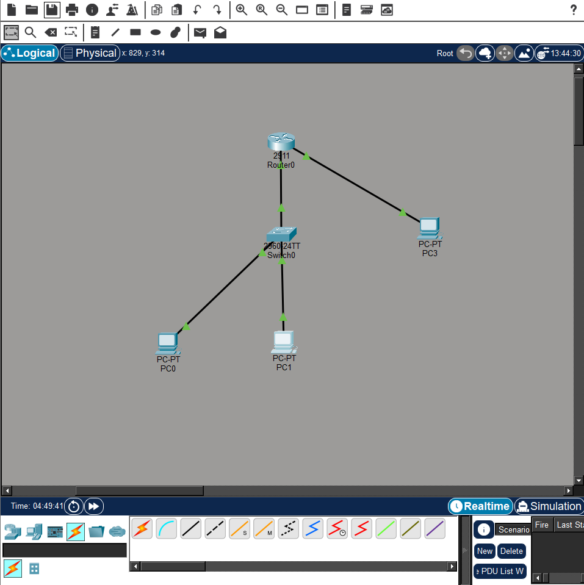
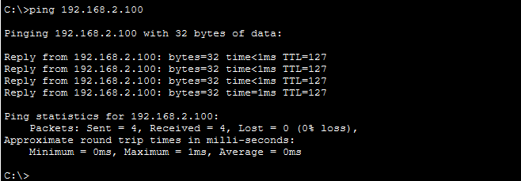
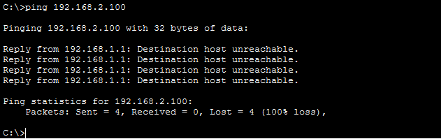
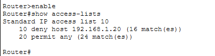

# 🛡️ Secure Network Topology with Cisco ACL Implementation

This project demonstrates a secure network infrastructure designed in Cisco Packet Tracer. It features inter-subnet traffic control and optimized security using standard Access Control Lists (ACLs).

## 🏗️ Topology Design
The network is logically segmented into two distinct subnets connected via a Cisco 2911 Router:
- **User Subnet (Subnet A):** `192.168.1.0/24` (Hosts PC0 and PC1)
- **Server Subnet (Subnet B):** `192.168.2.0/24` (Hosts the critical Server)



## 🔐 Security Policy
The configuration follows the **Principle of Least Privilege**:
- **PC0 (Authorized):** Granted full access to the Server. `192.168.1.10/24` 
- **PC1 (Unauthorized):** Access to the Server is strictly denied at the Router interface to prevent unauthorized entry. `192.168.1.20/24` 

### Router Configuration (Cisco IOS CLI):
```bash
enable
configure terminal
# Define the ACL: Deny specific host, permit others
access-list 10 deny 192.168.1.20
access-list 10 permit any

# Apply the ACL to the inbound interface
interface GigabitEthernet 0/0
 ip access-group 10 in
```

## ✅ Verification & Testing

To ensure the network security policy is correctly implemented, several connectivity tests were performed.

### 1. Authorized Access Test (PC0)
**Scenario:** PC0 (`192.168.1.10/24`) attempts to reach the Server (`192.168.2.100/24`).
**Expected Result:** Success (ICMP Reply).
**Actual Result:** ✅ The connection is established successfully as PC0 is permitted by the ACL.



---

### 2. Unauthorized Access Test (PC1)
**Scenario:** PC1 (`192.168.1.20/24`) attempts to reach the Server.
**Expected Result:** Denied (Destination Host Unreachable).
**Actual Result:** ❌ The connection is blocked by the Router. The Router drops the packets from this specific host, proving the ACL is active.



---

### 3. Security Audit (Router Match Logs)
By executing the `show access-lists` command on the Cisco 2911 Router, we can verify the "match" count. Each match represents a packet that was successfully inspected and dropped based on our security policy.

**Command:** `Router# show access-lists 10`


